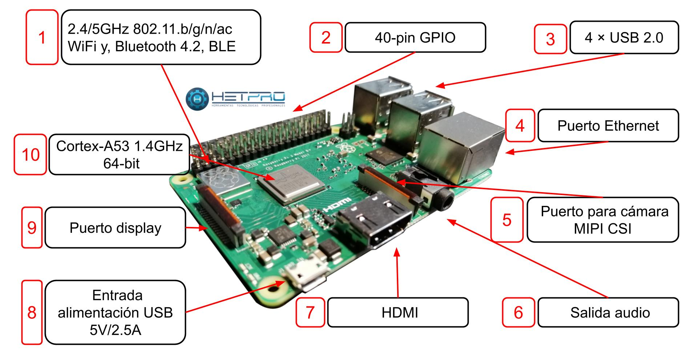
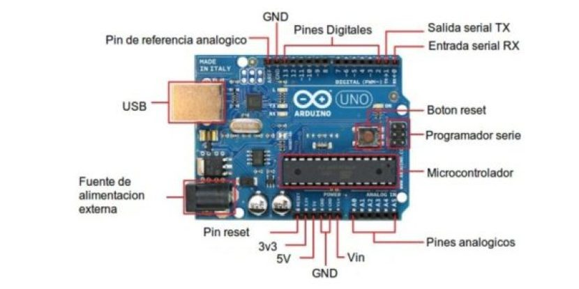
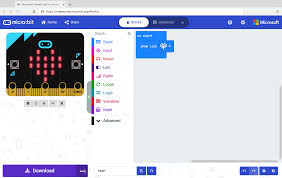
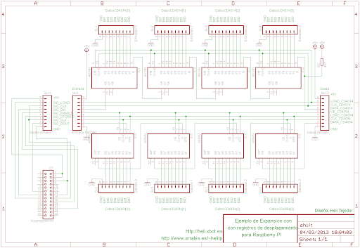
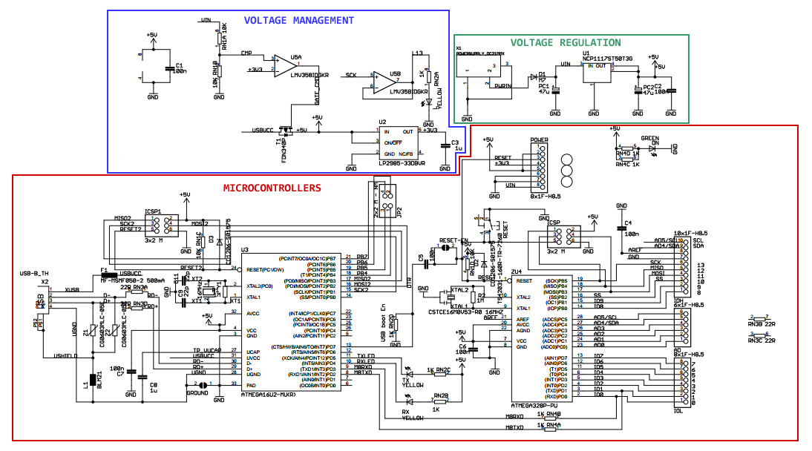
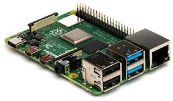
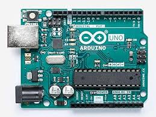
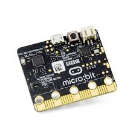

<H2>INFORME</H2>

<H3>1. PLANTEAMIENTO DEL PROBLEMA</H3>

Raspberry Pi es un ordenador de placa reducida, ordenador de placa única u ordenador de placa simple (SBC) de bajo costo desarrollado en el Reino Unido por la Raspberry Pi Foundation, con el objetivo de estimular la enseñanza de informática en las escuelas.El modelo original se convirtió en más popular de lo que se esperaba, hasta incluso vendiéndose fuera del mercado objetivo para usos como robótica. No incluye periféricos (como teclado y ratón) o carcasa.La fundación da soporte para las descargas de las distribuciones para arquitectura ARM, Raspbian (derivada de Debian), RISC OS 5, Arch Linux ARM (derivado de Arch Linux) y Pidora (derivado de Fedora) y promueve principalmente el aprendizaje del lenguaje de programación Python. Otros lenguajes también soportados son Tiny BASIC, C, Perl y Ruby.La mayoría de Raspberry Pis son hechas en una fábrica de Sony en Pencoed, Wales; algunas son hechas en países asiáticos como China o Japón(Wikipedia 2012-2018).

El hardware de Arduino Uno es un circuito impreso o placa que contiene una MCU o microcontrolador y muchos otros componentes electrónicos que nos permite usar de forma fácil esta MCU en la vida real.También cómo ya hemos comentado las placas de Arduino al ser un hardware de diseño libre sus esquemas están disponibles en internet, para que cualquiera puede hacer su propia placa a su manera.Usar circuitos impresos de Arduino Uno para construir prototipos o proyectos finales como plataforma, es la mejor forma de garantizar la longevidad y continuidad del mismo(Iescamp 2016).

BBC micro: bit es una pequeña tarjeta programable de 4x5 cm diseñada para que aprender a programar sea fácil, divertido y al alcance de todos.Gracias a la gran cantidad de sensores que incorpora, sólo con la tarjeta se pueden llevar a cabo centenares de proyectos. BBC micro: bit también es una plataforma IoT (Internet of Things), lo que la hace muy interesante para usuarios avanzados.Y es Open Source, por supuesto. Tanto el hardware como el software de “micro:bit” es de código abierto.Tiene un entorno de programación gráfico propio: MakeCode de Microsoft, un sencillo editor gráfico online muy potente y gratuito que posibilita introducirnos en el mundo de la programación de forma intuitiva a través del lenguaje de programación visual o de bloques(Microes 2016). 

<H3>2. OBJETIVOS</H3>
<b>Objetivos Generales</b>

- Desarrollar correctamente los literales propuestos en el trabajo del Producto Unidad.

- Identificar cual de las 3 plataformas es la mejor.

<b>Objetivos Específicos</b>

- Realizar una indagacion Bibliografica sobre la raspberry pi,arduino uno y microbit.

- Describir los componentes y caracteristicas de cada uno de los hardwares.

- Realizar dos ejemplos de programacion en cada una de las plataformas.

- Identificar que plataforma nos brinda mas facilidad a la hora de utilizarla.

<H3>3. ESTADO DEL ARTE</H3>
<b>Educación de alta calidad y bajo costo con Raspberry Pi</b> 

La computadora de placa única Raspberry Pi (SBC) ha ganado popularidad en diversas áreas, mientras que la educación sigue siendo el impulsor fundamental detrás del diseño. Bajo los kits de costos son provistos, específicamente para educación, por Fundación Raspberry Pi en conjunto con Google. Estos kits Modificaciones son usados para resultados educativos óptimos. El tutorial consiste en ejemplos de proyectos y ejemplos de código que pueden ser adaptado rápidamente para diversas situaciones de aprendizaje. Una lista de hardware o BOM, poblada y optimizada para un aprendizaje rentable y efectivo será proporcionado. La familia Raspberry Pi y la familia Arduino también se puede usar para educación, como alternativas o en combinación con la Raspberry Pi Zero y las diferencias serán destacadas y discutidas. Numerosas webs están en continua evolución de recursos, así como implementaciones de hardware financiadas por crowdfunding están disponibles para adaptarlos a la educación, la configuración se discutirá brevemente.   
Nuestro objetivo es describir el uso de Single Board Computadoras (SBC) como Raspberry Pi y Microcontroladores como Arduino en la creación rentable de soluciones para promover la educación STEM en países en desarrollo. Nuestra experiencia ha sido principalmente con Raspberry Pi y por eso escribimos sobre ese sistema. Esto no es una recomendación y es solo un modelo. Varios SBC y Los microcontroladores están disponibles en el mercado y potencialmente incluso los nuevos pueden diseñarse según sea necesario. Una comparación y un ajuste ideal para un conjunto dado de escenarios de instrucción son fuera del alcance de este trabajo. Hay varios recursos disponibles para este propósito(Yamanoor, N. S., & Yamanoor, S. (2017)).  
 <b>Diseño e implementacion de un hogar con sistema de automatizacion basado en teledeteccion tecnica con microcontrolador Arduino Uno</b> 
El objetivo principal de este trabajo es diseñar e implementar un sistema de automatización del hogar basado en detección remota utilizando Arduino Uno Kit como controlador principal para este esquema. El sistema propuesto tiene dos escenarios operativos. El primer escenario es controlar los dispositivos domésticos desde cualquier lugar utilizando un dispositivo inteligente como el teléfono con sensores remotos y control de tecnologías de internet por el usuario, se denomina escenario manual. El segundo escenario es monitorear y controlar los dispositivos del hogar por una automática gestión entre los sensores remotos y el controlador principal 'Arduino Uno Kit', se llama escenario automático. Para hacer un trato fácil para un usuario, la plataforma GUI de Matlab está diseñada como buena interfaz para controlar y monitorear el sistema. En el propuesto se demuestra que el sistema es simple, rentable y flexible que lo convierte en un candidato adecuado y bueno para el hogar inteligente futuro.  
 Hoy salvando la vida humana de lujo con el consumo de demanda de energía es el tema más importante que atrae a los investigadores en vivo y en casa que mejoran el estilo de vida de las personas mediante el diseño de un sistema doméstico de automatización inteligente óptimo flexible, barato y fácil de implementar y usar(Abu Sulayman, I. I. M., Almalki, S. H. A., Soliman, M. S., & Dwairi, M. O. (2017)).  
<b>Una solicitud de IoT de la comunidad de fabricantes de wearables</b>

Si queremos involucrar a una generación más joven para convertirse en futuros innovadores de ingeniería y ciencia, necesitamos ampliar la participación e interacción con la tecnología y la ciencia. Los movimientos de creadores tienen el potencial de hacer esto haciendo herramientas, materiales y procesos más fácilmente disponibles para las personas en un entorno de aprendizaje más informal que puede no identificarse inicialmente como creadores. Abordamos una limitación principal de dicho fabricante comunidades, donde puede ser difícil para los participantes desarrollarse y continuar una aplicación fuera del tiempo limitado inherente y espacio del evento creador. Realizamos una serie de 6 eventos de creadores dirigido a grupos de seis niños de 14 a 15 años que se centraron en el aprendizaje haciendo que el dispositivo BBC micro: bit interactúe como parte de un Aplicación de Internet de las cosas (IoT). Informamos sobre un evento y un desafío para desarrollar una aplicación IoT portátil para compartir abordar el objetivo para los participantes que podrían mantener el interés fuera del evento. Esta aplicación fue una insignia del club para enviar Mensajes secretos a los miembros. La evaluación reveló un gran interés. compromiso y compromiso con el diseño social ponible, como se ve a través de los estudiantes construyendo y participando en el exitoso uso de la aplicación a través de la autenticidad. Este autentico compromiso con la resolución de problemas a nivel técnico para motivar los objetivos personales se inspiraron a través de un diseño portátil que se puede compartir que los participantes consideraron beneficioso.  
En los últimos años, The Internet of Things (IoT) se ha convertido en la corriente principal, capturando industrias innovadoras y economistas a nivel mundial. Poslad describe la rica funcionalidad de computación ubicua, muchas de estas ideas y aplicaciones resuena con el sensor portátil y conectado del IoT, experiencias enriquecidas con datos. Tanto Gouaïch  como Poslad  refieren a esta idea de información y comunicación ubicua tecnologías y dispositivos "existentes en todas partes". Estas tecnologías y dispositivos forman parte de una red altamente distribuida, sistemas conectados y en red que son móviles, inalámbricos, activa y receptiva, haciendo que la información sea casi perfecta y tareas disponibles en todas partes, y a través del soporte de uso humano intuitivo(Charlton, P., & Poslad, S. (2016)).  

<H3>4. MARCO TEORICO</H3>

<b>1. Hardware:

a. Describir todos los componentes electrónicos y conectores de las
siguientes tarjetas de desarrollo:

i. Raspberry Pi.
</b>

•	SoC: Broadcom BCM2835 (CPU, GPU y SDRAM)

Broadcom Corporation es uno de los principales fabricantes de circuitos integrados para comunicaciones de banda ancha de los Estados Unidos. Fundada en 1991 por Henry Samueli (presidente del consejo de administración y CTO) y Henry Nicholas, salió al mercado bursátil en 1998 y actualmente emplea a más de 10.000 personas en todo el mundo.Broadcom forma parte del Top 20 mundial de empresas de semiconductores.

BCM2835 es el microprocesador de tipo system on a chip (SoC) que lleva la Raspberry Pi y que incluye un núcleo ARM1176JZF-S a 700 MHz que puede llegar 1 GHz haciendo overclock y una GPU VideoCore IV.

•	CPU ARM1176JZF-S a 700 MHz de velocidad de reloj

ARM11 es un grupo de núcleos de procesadores RISC ARM de 32 bits con licencia de ARM Holdings .La familia de núcleos ARM11 consta de ARM1136J (F) -S, ARM1156T2 (F) -S, ARM1176JZ (F) -S y ARM11MPCore. Dado que los núcleos ARM11 se lanzaron entre 2002 y 2005 , ya no se recomiendan para nuevos diseños de circuitos integrados, sino que se prefieren los núcleos ARM Cortex-A y ARM Cortex-R .La microarquitectura ARM11 (anunciada el 29 de abril de 2002) introdujo las adiciones arquitectónicas ARMv6 que se habían anunciado en octubre de 2001. Estas incluyen instrucciones de medios SIMD , soporte multiprocesador y una nueva arquitectura de caché. La implementación incluyó una línea de procesamiento de instrucciones significativamente mejorada, en comparación con las familias ARM9 o ARM10 anteriores , y se usa en teléfonos inteligentes de Apple , Nokia y otros. El núcleo ARM11 inicial (ARM1136) se lanzó a los licenciatarios en octubre de 2002.La familia ARM11 son actualmente los únicos núcleos de arquitectura ARMv6. Sin embargo, existen núcleos ARMv6-M ( Cortex-M0 y Cortex-M1 ), que abordan aplicaciones de microcontroladores ; Los núcleos ARM11 apuntan a aplicaciones más exigentes.

•	GPU Broadcom VideoCore IV

VideoCore es un procesador multimedia móvil de baja potencia desarrollado originalmente por Alphamosaic Ltd y ahora propiedad de Broadcom . Su arquitectura DSP bidimensional lo hace lo suficientemente flexible y eficiente como para decodificar (así como codificar) una serie de códecs multimedia en el software, manteniendo un bajo consumo de energía.El núcleo de propiedad intelectual de semiconductores ( núcleo SIP) se ha encontrado hasta ahora solo en Broadcom SoCs.Los dispositivos multimedia móviles requieren mucho procesamiento de video de alta velocidad, pero a baja potencia para una batería de larga duración. El núcleo del procesador ARM tiene una alta cifra de IPS por vatio (y por lo tanto domina el mercado de la telefonía móvil), pero requiere coprocesadores de aceleración de video y controladores de pantalla para un sistema completo. La cantidad de datos que pasan entre estos chips a alta velocidad da como resultado un mayor consumo de energía. Los coprocesadores especializados pueden optimizarse para el rendimiento sobre la latencia (más núcleos y paralelismo de datos, pero a una velocidad de reloj más baja), y tienen conjuntos de instrucciones y arquitecturas de memoria diseñadas para el procesamiento de medios (por ejemplo, aritmética de saturación y manejo de formatos de datos especializados) .El VideoCoreIV-AG100-R que se encuentra en Raspberry Pi 1, 2 y 3 está documentado para ser totalmente compatible con OpenGL ES 2.0 y OpenVG 1.1.El motor 3D está compuesto por varios subsistemas, siendo los más abundantes los QPU. Una QPU es un procesador de 16 vías de instrucción única, datos múltiples (SIMD)."Cada procesador tiene dos ALU de punto flotante de vector que realizan operaciones de multiplicación y no multiplicación en paralelo con una latencia de ciclo de instrucción única. Internamente, la QPU es un procesador SIMD de 4 vías multiplexado 4 veces durante cuatro ciclos, lo que lo hace particularmente adecuado para el procesamiento flujos de cuadrantes de píxeles ", según la Guía de referencia de arquitectura 3D VideoCore® IV de Broadcom ."Las QPU se organizan en grupos de hasta cuatro, denominados sectores, que comparten ciertos recursos comunes", continúa el documento. cf. Vértice y sombreador .Estos "cortes" corresponden aproximadamente a las unidades de cómputo de AMD .Al menos VC 4 (por ejemplo, en Raspberry Pi) no es compatible con la compresión de textura S3 (S3TC).Probablemente tampoco sea compatible con la compresión adaptable de textura escalable (ASTC).De algoritmos de compresión de video actualmente en uso amplio, como H.263 , H.264 / MPEG-4 AVC , MPEG-4 , MPEG-2 , MPEG-1 , H.265 , Daala , Theora , VP8 y VP9 , Broadcom's VideoCore Los productos admiten la aceleración de hardware de algunas operaciones. En algunos casos, solo descompresión, solo compresión o ambas hasta una determinada resolución (por ejemplo, 720p o 1080p) y hasta una determinada velocidad de cuadros (por ejemplo, 30 o 60 cuadros por segundo).Conjunto de instrucciones escrito con procesamiento de video en mente desde el principio. Por ejemplo, la aritmética de saturación de modo que la suma de dos píxeles brillantes no se "envuelva" en valores oscuros.Una serie de unidades de procesamiento de gráficos para la computación paralela de datos de video a una velocidad de reloj relativamente baja.La integración muy alta coloca la CPU, las GPU, la memoria y los circuitos de visualización en un solo chip, eliminando la carga de energía de conducir autobuses rápidos sin chip(Wikipedia,2020).

•	Memoria RAM 512 MB (compartidos con la GPU)

RAM son las siglas de «Random Access Memory» o «Memoria de Acceso Aleatorio». Su formato más extendido es el de un PCB a modo de pastilla rectangular sobre el que se asientan diferentes chips que contienen cantidades determinadas de memoria RAM.La memoria RAM siempre se ha medido partiendo de un pilar básico: su capacidad. Los kilobytes fueron el nivel más utilizado entre finales de los setenta y principios de los ochenta. Posteriormente dejaron paso a los megabytes y finalmente llegamos a los gigabytes, que es la medida que utilizamos actualmente, aunque ya empezamos a hablar de terabytes en el sector profesional.Como el procesador la memoria RAM se inserta en la placa base y se comunica con diversos elementos del sistema. Su función principal es almacenar datos e instrucciones para que puedan ser accedidos por otros componentes básicos, de manera que evita que tengan que volver a pasar por el procesador o incluso por la tarjeta gráfica.

•	2 x USB 2.0

USB 2.0 es el segundo modelo del Bus de Serie Universal estándar. Muchos dispositivos utilizan la conexión USB para transferir datos desde y hacia una computadora. El aumento en la velocidad de transferencia implica un aumento en el procesamiento de información; esta diferencia de velocidad será especialmente notoria en dispositivos USB externos, como grabadoras de CD y discos duros.

•	1 x Salida audio mini jack 3.5 mm

El miniaturizado de 3,5 mm (aproximadamente ⅛″): es el tipo de conector más utilizado, usado para la salida de auriculares en dispositivos portátiles, como reproductores de mp3. Apareció en 1964 aunque su popularidad creció con la aparición la radio EFM-117J de Sony en 1979. Este diámetro de conector es también conocido informalmente como "minijack". Actualmente, desde el año 2016, hay una ligera tendencia a hacerlos desaparecer en los dispositivos móviles como en el Lenovo Moto Z y el iPhone 7.Las tarjetas de sonido de las computadoras comunes utilizan este tipo de conectores, siempre de tipo hembra, al que hay que conectar los altavoces u otros dispositivos por medio de un conector macho de 3,5 mm de diámetro. En el caso de las computadoras, como tienen varios conectores de este tipo, se utiliza un código de colores para distinguirlos:

Verde: salida de línea estéreo para conectar altavoces o auriculares.

Azul: entrada de línea estéreo, para capturar sonido de cualquier fuente, excepto micrófonos.

Rosa/Rojo: entrada de audio, para conectar un micrófono.

Las computadoras dotadas de sistema de sonido envolvente 7.1 usan además estas conexiones:

Gris: salida de línea para conectar los altavoces laterales.

Negro: salida de línea para conectar los altavoces traseros.

Naranja: salida de línea para conectar el altavoz central o el subwoofer (subgrave).

•	1 x Salida audio/vídeo HDMI

Es la llave que permite conectar aparatos para pasar a otro nivel en el consumo de audio y video. Todo lo que debés saber sobre el cable HDMI y sus usos.HDMI es una sigla en inglés que significa High Definition Multimedia Interface (interfaz multimedia de alta definición) y se refiere a la norma de conexión que permite transmitir audio y video sin comprimir desde un equipo a otro y con un único cable, incluido el contenido en alta definición, que es el más utilizado en estos casos.Gracias a estos cables podemos vincular, por ejemplo, una notebook a un televisor: de esta manera se puede disfrutar en la pantalla grande todo el contenido multimedia que tengamos en nuestra computadora. La gran ventaja del HDMI sobre el DVI, que también es capaz de transmitir contenido digital, es que el sistema DVI no convierte las señales de audio, con lo cual necesitamos un cable extra.

•	1 x Salida vídeo compuesto RCA

El conector RCA, también llamado conector Cinch, es un tipo de conector eléctrico común en el mercado audiovisual. El nombre proviene del nombre de la antigua compañía de electrónica estadounidense Radio Corporation of America, que fue la que introdujo el diseño en 1940.En muchas áreas geográficas ha sustituido al conector típico de audio (jack), muy usado desde que los reproductores de casete se hicieron populares, en la década 1970. Ahora se encuentra en la mayoría de televisores; en otros equipos, como grabadores de vídeo o DVD, a la década de 2010 está siendo sustituido por el High-Definition Multimedia Interface (HDMI).El conector macho tiene un polo en el centro (+), rodeado de un pequeño anillo metálico (–), a veces con ranuras, que sobresale. El conector hembra tiene como polo central un agujero cubierto por otro aro de metal, más pequeño que el del macho para que este se sujete sin problemas. Ambos conectores (macho y hembra) tienen una parte intermedia de plástico que hace de aislante eléctrico.Un problema del sistema RCA es que cada señal necesita su propio cable. Otros tipos de conectores son combinados, como el euroconector (SCART), usado exclusivamente en Europa.La señal de los RCA no es balanceada por lo que corresponde generalmente a -10 dBV. Esto hace que no se utilicen profesionalmente para señales analógicas.

•	1 x Micro USB

El USB, las siglas para Universal Serial Bus (en español Puerto de Serie Universal), es un puerto estándar para conexiones externas que permite conectar prácticamente cualquier tipo de dispositivo a un ordenador u otros aparatos como televisores o cadenas musicales: teclados, ratones, pen drives, impresoras, mp3, teléfonos móviles y así podemos seguir con una interminable lista. Los cables de conexión USB tienen dos extremos. Por uno está la conexión al PC, por el otro está la conexión al dispositivo y esta conexión puede ser de varios tipos. El Micro USB es uno de estos tipos y es utilizado por dispositivos pequeños como los teléfonos móviles, los PDA (Personal Digital Assistant) o las tablets. Otros estándares son el Mini USB, un tipo de conector que reemplazó al conector USB normal y que ahora está siendo reemplazo por el Micro USB en la mayoría de dispositivos portátiles.

•	1 x RJ45 10/100 Ethernet RJ45

RJ45 es una interfaz física comúnmente utilizada para conectar redes de computadoras con cableado estructurado (categorías 4, 5, 5e, 6 y 6a). Posee ocho pines o conexiones eléctricas, que normalmente se usan como extremos de cables de par trenzado (UTP).Es parte del Código Federal de Regulaciones de Estados Unidos.Es utilizada comúnmente con estándares como TIA/EIA-568-B, que define la disposición de los pines (patillaje) o wiring pinout.Una aplicación común es su uso en cables de red Ethernet, donde suelen usarse cuatro pares (ocho pines). Otras aplicaciones incluyen terminaciones de teléfonos (dos pares), por ejemplo: en Francia y Alemania, y otros servicios de red como RDSI, T1 e incluso RS-232.

•	Slot SD para tarjeta SD que contendrá el sistema operative y programas

Las ranuras para tarjetas de memoria Secure Digital (SD) son comunes en muchos dispositivos multimedia portátiles, como cámaras digitales, PDAs, teléfonos celulares, videocámaras digitales, netbooks, laptops, etcétera. Estas ranuras tienen la habilidad de leer y escribir datos a y desde tarjetas de memoria SD, que permiten que los datos sean guardados para ser accedidos más tarde. Este tipo de memorias se han hecho muy populares desde la década del 2000, ya que su tamaño compacto y gran capacidad de memoria hace que las tarjetas SD sean muy prácticas en la era electrónica.

•	Alimentación: 5V/700 mA (3.5 W) vía micro USB.

Voltaje de entrada: AC 85~265 VAC 50/ 60Hz

Salida de voltaje Dc 5V ( +/-0.2)

Salida de corriente 700mA

Potencia 3.5W

ii. Arduino Uno

•	Conector USB

Los conectores USB (Universal Serial Bus) fueron desarrollados en el año 1994 por un grupo de siete compañías (Intel, Compaq, DEC, IBM, Microsoft, NEC y Nortel) en un esfuerzo de unificar toda la miríada de conectores que empleaban los periféricos en aquel tiempo, de manera que fuera más sencillo para los usuarios, poder conectarlos a sus ordenadores. Los primeros dispositivos que eran capaz de soportar el nuevo estándar se comercializaron de la mano de Intel en el año 1995. Y el primer Sistema Operativo que los soportaba de serie fue Windows 95.Los primeros USB 1.0 solo soportaban una velocidad de transferencia de archivos de 1,5 Mbps en modo de baja velocidad, y hasta 12 Mbps en modo de alta velocidad.

•	Regulador de voltaje de 5V

Es un dispositivo electrónico que tiene la capacidad de regular voltaje positivo de 5V a 1A de corriente, en la mayoría de los desarrollos con arduino o con programadores Pic estamos obligados a garantizar una fuente de tensión constante, eso disminuye la posibilidad de dañar nuestro circuito debido a oscilaciones en los niveles de tensión, la forma mas practica y simple de lograr esto es mediante el Regulador de voltaje 7805, básicamente es un dispositivo que cuenta con 3 pines.

•	Plug de conexión para fuente de alimentación externa

La fuente de alimentación o PSU (Power Supply Unit) es un elemento bastante importante en los equipos de sobremesa, ya que se encarga de suministrar y gestionar la energía en nuestro PC. Para ello, la obtiene del cable conectado a la red y mediante un transformador y una placa con circuitería, irá dando diferentes salidas de tensión para poder alimentar a cada componente interno de la caja o torre.
Cada una de esas salidas de tensión tienen diferentes conexiones o molex para conectar a la placa base, las unidades ópticas instaladas, los discos duros, etc. Estos conectores resultan vitales a la hora de elegir una fuente de alimentación, y no solo la potencia soportada o las tecnologías activas o pasivas de protección que tienen.

•	Puerto de conexiones

En informática, un puerto es una interfaz a través de la cual se pueden enviar y recibir los diferentes tipos de datos.La interfaz puede ser de tipo física (hardware) o puede ser a nivel lógico o de software, en cuyo caso se usa frecuentemente el término puerto lógico (por ejemplo, los puertos de redes que permiten la transmisión de datos entre diferentes computadoras).Se denomina “puerto lógico” a una zona o localización de la memoria de acceso aleatorio (RAM) de la computadora que se asocia con un puerto físico o un canal de comunicación, y que proporciona un espacio para el almacenamiento temporal de la información que se va a transferir entre la localización de memoria y el canal de comunicación.

•	Puertos de entradas análogas

Una señal eléctrica analógica es aquella en la que los valores de la tensión o voltaje varían constantemente y pueden tomar cualquier valor. En el caso de la corriente alterna, la señal analógica incrementa su valor con signo eléctrico positivo (+) durante medio ciclo y disminuye a continuación con signo eléctrico negativo (–) en el medio ciclo siguiente.

•	Microcontrolador ATmega 328

El Atmega328 AVR 8-bit es un Circuito integrado de alto rendimiento que está basado un microcontrolador RISC, combinando 32 KB (ISP) flash una memoria con la capacidad de leer-mientras-escribe, 1 KB de memoria EEPROM, 2 KB de SRAM, 23 líneas de E/S de propósito general, 32 registros de proceso general, tres temporizadores flexibles/contadores con modo de comparación, interrupciones internas y externas, programador de modo USART, una interfaz serial orientada a byte de 2 cables, SPI puerto serial, 6-canales 10-bit Conversor A/D (canales en TQFP y QFN/MLF packages), temporizador "watchdog" programable con oscilador interno, y cinco modos de ahorro de energía seleccionables por software. El dispositivo opera entre 1.8 y 5.5 voltios. Por medio de la ejecución de poderosas instrucciones en un solo ciclo de reloj, el dispositivo alcanza una respuesta de 1 MIPS, balanceando consumo de energía y velocidad de proceso .

•	Botón Reset

Es habitual que la idea de reset se emplee para nombrar al regreso de las condiciones originales de un sistema. Tomemos el caso de una computadora (ordenador). Cuando encendemos el equipo, se inicia el sistema operativo con una cierta configuración. Si luego de ejecutar diversas tareas deseamos volver al estado inicial, podemos apagar y volver a prender la computadora o, simplemente, pulsar la tecla de reset para reiniciar la máquina.

•	Pines de programación ICSP

ICSP es un conector consistente en 6 señales: MOSI, MISO, SCK, RESET, VCC, GND y además de ser un puerto para programar Arduino, también es el conector de expansión del bus SPI mediante el que también podemos comunicar periféricos y es usado en algunos casos para comunicar Arduino con los shields. Se puede considerar el ICSP como un “esclavo” del master del bus SPI del microcontrolador.En referencia a los microcontroladores AVR, el ICSP es la forma que tenemos de programarlos de forma in-system, conectando un programador a estos 6 pines. El programador manda el fichero hex ya compilador al microcontrolador mediante un protocolo concreto como puede ser el STK500.

•	Led ON

•	Leds de Recepción y Transmisión

•	Led pin 13

n diodo emisor de luz o led5(también conocido por la sigla LED, del inglés light-emitting diode) es una fuente de luz constituida por un material semiconductor dotado de dos terminales. Se trata de un diodo de unión p-n, que emite luz cuando está activado.Si se aplica una tensión adecuada a los terminales, los electrones se recombinan con los huecos en la región de la unión p-n del dispositivo, liberando energía en forma de fotones. Este efecto se denomina electroluminiscencia, y el color de la luz generada (que depende de la energía de los fotones emitidos) viene determinado por la anchura de la banda prohibida del semiconductor. Los ledes son normalmente pequeños (menos de 1 mm2) y se les asocian algunas componentes ópticas para configurar un patrón de radiación.

•	Puertos de conexiones de pines de entradas o salidas digitales

l ATmega328p como cualquier otro microcontrolador tiene registros, algunos de estos registros están relacionados con los puertos de entrada/salida, cada puerto tiene un nombre específico y sus registros asociados, de hecho, el 328p tiene el puerto B, C y D, y cada puerto un diferente número de pines (Esta es una restricción del paquete de 28 pines PDIP y no desde el microcontrolador, ya que un PDIP 40 pines, por ejemplo, tiene 4 puertos con los 8 bits cada uno), el único puerto que tiene el total de sus 8 pines de entradas/salidas es PORTD.Cada pin puede tener múltiples funciones, como la generación de PWM, o las capacidades de ADC, los pines 6 y 7 del PORTB son los pines de entrada para el oscilador de cristal, y pin 6 del PORTC le corresponde al botón de reinicio.  En esta imagen se puede ver todas las funciones alternativas que cada pin puede tener.

•	Puerto de conexiones 5 entradas o salidas adicionales

Pero a bajo nivel estas funciones están manejando registros. Para empezar hay un registro dedicado para cada puerto que define si cada pin es una entrada o una salida, que es el registro de DDRX, donde x es la letra del puerto que queremos configurar, en el caso de la Arduino hay DDRB, DDRC y DDRD. Como toda variable lógica, cada bit en los registros DDRX puede ser 1 ó 0, poner un bit específico de DDRX a 1 configura el pin como salida y ponerla a 0 configura el pin como una entrada.

•	salida a tierra GND

La definición clásica de tierra (en inglés de Estados Unidos ground de donde viene la abreviación GND, earth en inglés de Reino Unido) es un punto que servirá como referencia de tensiones en un circuito (0 voltios).

•	pin AREF

En muchas ocasiones cuando estamos trabajando en nuestros proyectos electrónicos se es necesario trabajar a X voltaje de referencia. Supongamos que tenemos un sensor de temperatura LM35, este sensor ofrece una salida de tensión lineal con respecto a la temperatura, utiliza un factor de escala de 10 mV/°C. Imaginemos entonces que necesitamos este sensor para medir la temperatura de cierto lugar utilizando nuestro Arduino UNO. Para poder leer la temperatura del lugar necesitamos convertir la medida de temperatura que es una medida física a otra de tipo eléctronico. Este trabajo es el que precisamente hace el sensor. Ahora, el voltaje de salida que nos proporciona el LM35 es una señal analógica que debemos convertirla a una señal digital para poder procesarla, el mago que realiza este proceso se llama Conversor Analógico/Digital.

•	Chip de comunicación:

Este chip de comunicaciones multiprotocolo incorpora una gran selección de periféricos analógicos y digitales que pueden interactuar sin intervención de la CPU a través del sistema PPI (Programmable Peripheral Interconnect).Un esquema de mapeado flexible de GPIO de 31 pines permite E/S como, por ejemplo, interfaces serie, PWM, y demodulación de cuadratura para ser mapeado en cualquier pin de dispositivo tal y como dictan los requisitos PCB. Esto permite una total flexibilidad de diseño asociada con la ubicación pinout y la función.

iii. MicroBit.

•	2 botones.

•	Una pequeña pantalla formada por 25 LEDs.

Una Pantalla de LED es un dispositivo electrónico conformado por LEDs, que puede desplegar datos, información, imágenes, vídeos, etc.. a los espectadores cercanos a la misma. Se caracteriza por estar compuesto por diodos emisores de luz o LEDs, derivada de las siglas inglesas LED. Este tipo de pantallas no deben ser confundidas con las pantallas LCD o Plasma con Iluminación LED de fondo, empleados actualmente en ordenadores portátiles, monitores y televisores. Donde las últimas mencionadas, si contienen LEDs, más solamente como iluminación de fondo o backlight (en inglés), para aumentar el brillo, nitidez, contraste, etc., de estos equipos con esta excelente tecnología.

•	Sensor magnético (brújula).

Son sensores que efectúan una conmutación electrónica mediante la presencia de un campo magnético externo, próximo y dentro del área sensible. Estos sensores pueden ser sensibles a los polos del imán, o solamente a un polo.

•	Sensor IMU de inclinación y gravedad.

Una unidad de medición inercial o IMU (del inglés inertial measurement unit), es un dispositivo electrónico que mide e informa acerca de la velocidad, orientación y fuerzas gravitacionales de un aparato, usando una combinación de acelerómetros y giróscopos. Las unidades de medición inercial son normalmente usadas para maniobrar aviones, incluyendo vehículos aéreos no tripulados, entre muchos otros usos, y además naves espaciales, incluyendo transbordadores, satélites y aterrizadores.La IMU es el componente principal de los sistemas de navegación inercial usados en aviones, naves espaciales, buques y misiles guiados entre otros. En este uso, los datos recolectados por los sensores de una IMU permiten a un computador seguir la posición del aparato, usando un método conocido como navegación por estima.

•	Sensor de temperatura.

Los sensores de temperatura son dispositivos que transforman los cambios de temperatura en cambios en señales eléctricas que son procesados por equipo electrico o electrónico. Hay tres tipos de sensores de temperatura, los termistores, los RTD y los termopares.

•	Sensor de intensidad de luz.

Un sensor fotoeléctrico o fotocélula es un dispositivo electrónico que responde al cambio en la intensidad de la luz. Estos sensores requieren de un componente emisor que genera la luz, y un componente receptor que percibe la luz generada por el emisor.

•	20 entradas programables de entrada/salida.

Un sistema programable es aquel que consta de un circuito electrónico con algún tipo de microprocesador o microcontrolador integrado, capaz de almacenar una serie de instrucciones (programa informático) en una memoria interna con el propósito de realizar alguna acción para mantener el control y gestión de un sistema.

•	Conexión por Bluetooth.

Es una especificación tecnológica para redes inalámbricas que permite la transmisión de voz y datos entre distintos dispositivos mediante una radiofrecuencia segura (2,4 GHz). Esta tecnología, por lo tanto, permite las comunicaciones sin cables ni conectores y la posibilidad de crear redes inalámbricas domésticas para sincronizar y compartir la información que se encuentra almacenada en diversos equipos.

•	Conector serie por micro USB

El Micro USB es un puerto estándar que se utiliza para diversas conexiones externas; suele ser utilizado, específicamente, para dispositivos pequeños como es el caso de móviles, Tablet y asistentes personales digitales, entre otros.

2. Software:

<b>a. Describir cada una de las siguientes plataformas y el lenguaje de programación empleada para el desarrollo de aplicaciones en las tarjetas de desarrollo:

i. https://microbit.org/.

BBC micro: bit es una pequeña tarjeta programable de 4x5 cm diseñada para que aprender a programar sea fácil, divertido y al alcance de todos.Gracias a la gran cantidad de sensores que incorpora, sólo con la tarjeta se pueden llevar a cabo centenares de proyectos. BBC micro: bit también es una plataforma IoT (Internet of Things), lo que la hace muy interesante para usuarios avanzados.Y es Open Source, por supuesto. Tanto el hardware como el software de “micro:bit” es de código abierto.Tiene un entorno de programación gráfico propio: MakeCode de Microsoft, un sencillo editor gráfico online muy potente y gratuito que posibilita introducirnos en el mundo de la programación de forma intuitiva a través del lenguaje de programación visual o de bloques. Con él aprendemos a pensar como un programador sin caer en los molestos errores de sintaxis. MakeCode es, sin duda, una herramienta a tener muy en cuenta por nuestros profesores.BBC micro: bit también se puede programar con JavaScript, Pyton y Scratch (añadiendo una extensión).Sobradamente testado: Micro: bit es una iniciativa lanzada en 2012 por la BBC como parte de un “Programa de Alfabetización Informática”. Actualmente ya la están usando 780.000 niños de Reino Unido y el 75% de las escuelas están afiliadas a la Fundación Educativa Micro: bit.Fácil para los alumnos: El 90% de los estudiantes dijeron que BBC micro: bit les demostró que cualquiera puede aprender a programar.Fácil para los profesores: La mitad de los profesores que la han probado dicen sentirse más confiados enseñando robótica y programación, particularmente aquellos que no tienen muchos conocimientos de informática(Microes,http://microes.org/que-es-microbit.php).

ii. https://www.tinkercad.com/

Tinkercad es un software gratuito online creado por la empresa Autodesk, una de las empresas punteras en el software de diseño 3D de la mano de su programa estrella para tal fin, Inventor.El objetivo al usar Tinkercad debe ser una primera inmersión en el mundo del diseño 3D de una manera sencilla y atractiva, ya que la interfaz de trabajo es simple y muy atractiva inicialmente, si bien una vez dominados los conceptos básicos carece de herramientas para llegar a diseños complejos.Sus ventajas son claras: es sencillo de usar, su aspecto es atractivo y con unas pocas horas de entrenamiento podemos adquirir mucha destreza en su uso.Como desventaja podríamos señalar que es necesario tener una cuenta de correo para darse de alta como usuario y que sólo posee una versión online, por lo que hace falta conexión a internet.Vamos a realizar una guía de manejo básico para dominar las herramientas más usuales de trabajo. Tras los videotutoriales tienes un tutorial redactado paso a paso.El aspecto del software al comenzar un nuevo diseño es el que se muestra en la imagen. Sin extendernos en mucha explicación: en la esquina superior izquierda tenemos el botón “Tinkercad” para volver a nuestra pantalla de inicio como usuarios, en la zona inferior de la misma tenemos botones para controlar el punto de vista de nuestro diseño y el zoom sobre el mismo (aunque ambas opciones se pueden realizar con los botones del ratón o trackpad). En la zona derecha tenemos una serie de menús desplegables con opciones de diseño directas (formas geométricas, letras, símbolos...). En la zona superior tenemos los iconos de deshacer y rehacer y una serie de accesos directos a herramientas de trabajo y de diseño que se explicarán más adelante. En el centro nos encontramos el plano de trabajo (“Workplane”)(Eudoteca,https://www.educoteca.com/tinkercad.html).
iii. https://create.withcode.uk/</b>

Es una herramienta gratuita que le permite escribir, ejecutar, depurar y compartir programas de Python en su navegador web.No necesita descargar ni instalar nada. Los programas de Python no pueden acceder a sus archivos o dañar su computadora, por lo que es una forma segura de aprender a crear con código.Está diseñado para profesores y estudiantes en el Reino Unido y actaualmente usada por todo el mundo(Create with code,https://blog.withcode.uk/create-with-code-getting-started/).

Eche un vistazo a usted mismo y vea qué puede crear con el código
<H3>5. DIAGRAMAS</H3>
<b>Raspberry pi</b>

<b>Aurduino uno</b>

<b>Microbit</b>

<H3>6. LISTA DE COMPONENTES</H3>
<b>Raspberry pi</b>

•	SoC: Broadcom BCM2835 (CPU, GPU y SDRAM)

•	CPU ARM1176JZF-S a 700 MHz de velocidad de reloj

•	GPU Broadcom VideoCore IV

•	Memoria RAM 512 MB (compartidos con la GPU)

•	2 x USB 2.0

•	1 x Salida audio mini jack 3.5 mm

•	1 x Salida audio/vídeo HDMI

•	1 x Salida vídeo compuesto RCA

•	1 x Micro USB

•	1 x RJ45 10/100 Ethernet RJ45

•	Slot SD para tarjeta SD que contendrá el sistema operative y programas

•	Alimentación: 5V/700 mA (3.5 W) vía micro USB

<b>Aurduino uno</b>

•	Conector USB

•	Regulador de voltaje de 5V

•	Plug de conexión para fuente de alimentación externa

•	Puerto de conexiones

•	Puertos de entradas análogas

•	Microcontrolador ATmega 328

•	Botón Reset

•	Pines de programación ICSP

•	Led ON

•	Leds de Recepción y Transmisión

•	Puertos de conexiones de pines de entradas o salidas digitales

•	Puerto de conexiones 5 entradas o salidas adicionales

•	salida a tierra GND

•	pin AREF

•	Led pin 13

•	Pines de programación ISCP

•	Chip de comunicación

<b>Microbit</b>

•	2 botones.

•	Una pequeña pantalla formada por 25 LEDs.

•	Sensor magnético (brújula).

•	Sensor IMU de inclinación y gravedad.

•	Sensor de temperatura.

•	Sensor de intensidad de luz.

•	20 entradas programables de entrada/salida.

•	Conexión por Bluetooth.

•	Conector serie por micro USB

<H3>7. MAPA DE VARIABLES</H3>

La creación de una cuenta en <b>AWS</b> de tipo <b>ESTUDIANTIL</b> para el uso del servicio <b>AMAZON EC2</b>, viene a ser de tipo visual. Siendo la parte fundamental en la creación de nuestra máquina virtual, ya que sin ella no tendríamos acceso alguno a nuestro portal, y sin ser de tipo estudiantil no tendríamos ciertas funciones disponibles a menos que sea de pago.

<H3>8. EXPLICACION DEL CODIGO FUENTE</H3>

Nuestro proyecto no posee código fuente.

<H3>9. DESCRIPCION DE PRERREQUISITOS Y CONFIGURACION</H3>
<b>Aplicaciones Secundarias</b>

-	Control Remoto de Escritorio: Propiamente de la creación de Amazon EC2 para la reproducción visual de nuestra máquina virtual ya que en el sitio web solo poseemos la consola.

-	Navegador web (Google Chrome, Microsoft Edge): Tanto para la creación de la cuenta de usuario, como para la selección del sistema operativo a instalar.

<b>Configuración del terminal</b>

-	Se debe tener una cuenta ya sea ESTUDIANTIL o de PAGO para obtener ciertos beneficios a la hora de tener la máquina virtual, tanto en funciones como rapidez en transición de datos.

-	Ingresar el usuario y contraseña emitidos al correo electrónico para el uso únicamente de la máquina virtual mediante la aplicación secundaria.

-	Las MAQUINAS BASICAS tienen muy poco almacenamiento tanto en Disco Duro (30GB) como en Memoria RAM (1GB) es por ello que nos servirá únicamente para cosas muy sencillas.

-	El uso del control remoto de escritorio servirá para poder configurar de manera adecuada nuestra máquina virtual, como si tuviésemos una física.

<H3>10. APORTACIONES</H3>
<b>Máquina Virtual</b>

Es un software que simula un sistema de computación y puede ejecutar programas como si fuese una computadora real, pero lo hace de manera aislada además emula todos los elementos que posee una máquina en físico entre los componentes que simula se encuentran: disco duro, memoria RAM, tarjetas de red, tarjeta gráfica, etc.

<b>Sistema Operativo</b>

Es un conjunto de programas especialmente diseñado para hacer de intermediarios entre el usuario y la computadora, estos programas nos sirven para controlar el hardware de manera fácil y conveniente para el usuario, puede decirse que es corazón de la máquina ya que este tiene prioridad de ejecución ante otras aplicaciones además de controlar todos los periféricos disponibles en la computadora, los sistemas operativos más utilizados son: Microsoft Windows, Mac OS X y Linux Ubuntu.

<b>Tipos de Sistemas operativos</b>

- Sistema monoprocesador:  En el sistema monoprocesador existe una sola unidad de procesamiento central (CPU) capaz de ejecutar una serie de instrucciones de índole general.  
- Sistemas multiprocesadores: También llamados sistemas paralelos o estrechamente acoplados, los sistemas multiprocesadores tienen dos o más CPU que comparten buses y a veces el reloj, la memoria y los dispositivos periféricos. Los hay de dos tipos: 
• Multiprocesador asimétrico: cada procesador tiene una tarea específica. 
• Multiprocesadores simétricos: todos los procesadores realizan las mismas tareas.  
- Sistemas distribuidos: Un sistema distribuido presenta una colección de procesadores que no comparten memoria o reloj, y se comunican por una red interconectada.  
- Sistemas operativos de equipos portátiles: Los equipos portátiles de mano en este caso se refiere a aquellos dispositivos de pequeñas dimensiones que pueden ser manipulados con una mano, como por ejemplos las tabletas, los teléfonos inteligentes y las notebooks. Adicionalmente, los sistemas operativos de teléfonos deben adicionar componentes para las comunicaciones y la interface.  
- Sistemas operativos empotrados o en tiempo-real: Son los sistemas operativos instalados en los dispositivos médicos, electrónicos, electrodomésticos, automóviles, entre otros. Se encargan de tareas específicas del equipo en cuestión como: 
•	Ahorrar la potencia de la batería. 
•	Ajustarse a tiempos limitados. 
•	No requiere supervisión humana. 

<b>Parches de Seguridad</b>

Es un conjunto de cambios que se aplican a un software para corregir los errores o vulnerabilidades en programas o sistemas operativos, generalmente estos parches de seguridad (actualización de seguridad) son fabricados por fabricantes de software tras la detección de alguna vulnerabilidad y estos se instalan automáticamente o manualmente por el usuario.

<H3>11. CONCLUSIONES</H3>

-	Se pudo comprender los distintos beneficios que trae generar una máquina virtual ante una física. 
-	Dentro de las herramientas que nos brinda este servicio, pudimos hacer uso del Control Remoto del Escritorio, facilitándonos más el uso de nuestra máquina. 
-	Se genero con facilidad, rapidez nuestra máquina virtual dentro de Amazon EC2. 
-	El repositorio que carece este servicio, es extenso, cumpliendo con todas las expectativas ante los sistemas operativos que se necesiten. 
-	Cada uno de los protocolos de seguridad del servicio, satisfacen al usuario, entregando toda la confianza a su servicio. 

<H3>12. RECOMENDACIONES</H3>

-	Si la cuenta va a ser de tipo GRATUITA o ESTUDIANTIL, se deberá tener en cuenta que la máquina virtual solamente será para procedimientos extremadamente básicos.  
-	Para mayor facilidad de uso, configuración, se recomienda descargar el Control Remoto de Escritorio elaborado por AMAZON EC2 para visualizar su máquina virtual, debido a que la página web solamente posee la CONSOLA para poder configurar nuestra Virtual Machine.  
-	Tener en cuenta al momento de instalar un sistema operativo, no se lo hace mediante descarga o con la conexión de red, estos sistemas operativos ya vienen precargados en cada servicio, es por ello que solamente tomara ciertos minutos que se genere tu máquina virtual.  
-	Para el uso del Control Remoto de Escritorio y si la maquina desde donde lo ejecutas no tiene habilitado el virtualizado, se deberá activar esta sección ya sea desde la BIOS o desde nuestro PANEL DE CONTROL, caso contrario no nos permitirá que genere imagen nuestra Virtual Machine. 

<H3>13. CRONOGRAMA</H3>

<H3>14. BIBLIOGRAFIA</H3>

Charlton, P., & Poslad, S. (2016). A Sharable Wearable Maker Community IoT Application. 2016 12th International Conference on Intelligent Environments (IE).

Abu Sulayman, I. I. M., Almalki, S. H. A., Soliman, M. S., & Dwairi, M. O. (2017). Designing and Implementation of Home Automation System Based on Remote

Yamanoor, N. S., & Yamanoor, S. (2017). High quality, low cost education with the Raspberry Pi. 2017 IEEE Global Humanitarian Technology Conference

[1} JORGE CACHO HERNÁNDEZ, «Raspberry Pi: tutoriales Servidor web, ownCloud y XBMC.,» 27 Enero 2008. [En línea]. Available: file:///C:/Users/home/Downloads/102190284-Raspberry-Pi-tutoriales-servidor-web-ownCloud-y-XBMC.pdf

[2] Microes, «Caracteristiac y funcionalidades de MicroBit,» Microes, 15 septiembre 2017. [En línea]. Available: http://microes.org/caracteristicas.php

[3] C. Muñoz, «Historia de la informatica “Raspberry Pi,» Blog sobre Historia de la Informática, 18 Diciembre 2013. [En línea]. Available: https://histinf.blogs.upv.es/2013/12/18/raspberry-pi/#:~:text=Raspberry%20PI%20es%20una%20placa,de%20la%20inform%C3%A1tica%20en%20las

[4] Maria Sol Vicet Illas, «Historia y defincion de software libre en el mundo e lainformatica inicial,» Ecured.cu, Ecuador, 2017 Available:
https://www.ecured.cu/Software_libre#:~:text=Seg%C3%BAn%20la%20Free%20Software%20Foundation,programa%2C%20con%20cualquier%20prop%C3%B3sito%3B%20de

[5] N. SATHISH, KUMAR; B. VUAYALAKSHMI; R. JENIFER PRARTHANA; A. SHANKAR, « IOT BASED SMART GARBAGE ALERT SYSTEM USING ARDUINO UNO,» IEE, 2019
Available: https://ieeexplore.ieee.org/abstract/document/7848162

<H3>15. ANEXOS</H3>
<H3>15.1 MANUAL DE USUARIO</H3>
<H3>15.2 HOJAS TECNICAS</H3>

Nuestro proyecto no posee hojas técnicas.

