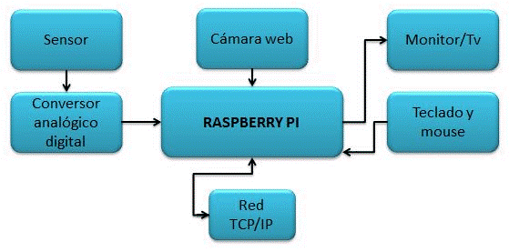
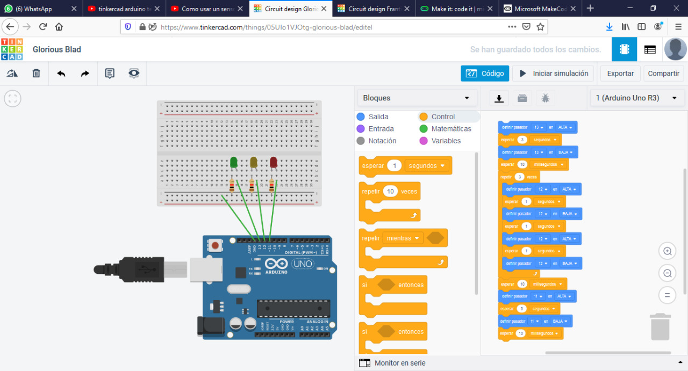

<H2>INFORME</H2>

<H3>1. PLANTEAMIENTO DEL PROBLEMA</H3>

Node-Red se encarga de visualizar las relaciones, funciones, que permita al usuario programar sin tener que tipear. Además, no solo actúa como herramienta de programación visual, es también un editor de flujo donde podemos añadir o eliminar nodos, para luego conectarlos entre ellos, dándoles el derecho a comunicarse. Esta herramienta, además de tener cantidad de beneficios, es open-source donde se permite gestionar y procesar los datos ingresados en tiempo real, lo cual nos realiza una simplificación gigantesca de todos sus servicios.

HMI, Human Machine Interface, es básicamente un panel del operador, con la cual pueden supervisar, coordinar y controlar los procesos industriales que se ejecuten o los de fabricación de su institución. Cabe tomar en cuenta que la información en tiempo real es propiamente de la HMI, donde proporcionan un conocimiento operacional del proceso y permiten el control, optimización mediante el control de estos.

Python, es un lenguaje de programación multiparadigma, por el hecho de soportar orientación a objetos, programación imperativa, programación funcional. Esta diseñado para ser leído con facilidad, lo que diferencia del demás lenguaje sería el uso de palabras en vez de símbolos, por lo demás sigue siendo open-source.

<H3>2. OBJETIVOS</H3>
<b>Objetivos Generales</b>

- Realizar un video explicando e identificando los temas relevantes a manera de un tutorial sobre el tema asignado.

- Conocer los beneficios de usar NODE-RED (HMI), Python.

<b>Objetivos Específicos</b>

-Analizar la utilidad del Dashboard en NODE-RED.

-Implementar un ejemplo que permita visualizar el HMI en NODE-RED.

-Emplear lo aprendido sobre Programación Orientada a Objetos en Python.

-Implementar un ejemplo que permita realizar una calculadora científica en Python.

<H3>3. ESTADO DEL ARTE</H3>
<b>Tecnologías Web en la Industria HMI</b> 

Este trabajo se ocupa de las tecnologías web en sistemas HMI industriales. Donde crean, diseñan y desarrollan un marco HMI, que se basa en tecnologías web y en la nube.
 
El resultado de este trabajo no es sólo una comparación de las soluciones disponibles, sino también el marco creado y la aplicación de demostración. Su framework se puede utilizar para una aplicación industrial de servidor privado o en la nube. Haciendo que su marco se ajustara y actualice fácilmente. En el cual se desarrollará una aplicación de demostración en el marco, que se basa en la tecnología web y se puede aplicar en dispositivos móviles.(Web technologies in industry HMI (n.d.).2020)

 <b>Desarrollo de un motor de simulación de sistema continuo en python Lenguaje de programación</b> 
Este artículo retrata el desarrollo de un motor de simulación en lenguaje de programación Python con enfoque en la simulación continua del sistema. Las características del motor se basan en el lenguaje y el software orientados a bloques para la simulación continua del sistema.
  
En primer plano el documento describe la necesidad y el uso de dicho motor. En segundo es analizar los conceptos de Python utilizados para la implementación del motor de simulación. Y, por último, este artículo representará la arquitectura del motor, los casos de uso y el uso de los conceptos analizados en el proceso de desarrollo.(Development of a Continuous System Simulation Engine in Python Programing Language (n.d.).2020)
 
<b>Internet de las cosas usando Node-Red y Alexa</b>

El Internet de las cosas significa aprender e interactuar con millones de cosas, incluyendo servicios, sensores, actuadores y muchos otros objetos en Internet.

A medida que aumenta el número de dispositivos en la nube, es necesario actualizar el firmware con más frecuencia. Esto es tedioso. Implica sacar los dispositivos instalados, cambiar el código y parpadear de nuevo. Para superarlos, el procesamiento de datos y la respuesta se puede hacer en otros lugares. Node-Red, una herramienta de cableado visual ayuda a conectar dispositivos con facilidad, lo que resulta en configuraciones de conexión rápidas y sin esfuerzo.(Internet of Things using Node-Red and alexa(n.d.).2020)

<H3>4. MARCO TEORICO</H3>

<b>Node-Red
</b>

Fue creada por Nick O’Leary y Dave Conway-Jones del grupo de Servicios de Tecnologías Emergentes de IBM en el año 2013. Su objetivo es dar solución a la complejidad que surge cuando queremos integrar nuestro hardware con otros servicios.

Una herramienta con la cual comunicamos el hardware y servicios, de manera rápida, eficaz. No solo actúa de manera de programación visual, sino se la utiliza para conectar dispositivos de hardware, APIs y servicios de internet. 

Node red esta adecuado para los equipos dedicados al internet de las cosas Industrial, personal dedicado al diseño y soluciones para la comunicación que existe en los equipos de planta.

Node-RED está creado a partir de NodeJS y la librería de JavaScript D3.js. Donde NodeJS proporcionara potencia suficiente para que Node-Red pueda ser escalable y fiable. Además de ser un software muy potente que permite que se ejecute programación por medio de JavaScript. Lo componen los nodos, los cuales se arrastran a través de una interfaz gráfica. Todos estos nodos se organizarán en flujos que se conectan entre ellos, todo de manera visual sin tener que generar una línea de código o texto.

<b>
HMI.
</b>

La interfaz hombre máquina, actúa entre el proceso y operadores, es resumen es un panel que lo maneja el operador, o también llamado Dashboard. Este panel que se genera seria la herramienta principal en la que los operadores coordinaran y controlaran los procesos industriales de las instituciones.

La información de operación que genera la institución es traducida al HMI en tiempo real, donde los gráficos ya sean de varias partes físicas o hardware, tomaran su información y la transmitirán, lo cual optimizara el resultado de procesos y su regulación de una manera simplificada al máximo.

En la actualidad, dado que las máquinas y procesos en general están implementadas con controladores y otros dispositivos electrónicos que dejan disponibles puertas de comunicación, es posible contar con sistemas de HMI bastantes más poderosos y eficaces, además de permitir una conexión más sencilla y económica con el proceso o máquinas

<b>Python
</b>
Es un lenguaje de programación, el cual se lo considera interpretado, por lo mismo funciona en cualquier tipo de sistema que integre su interpretador. Además, ofrece dialectos como el conocido Jython, el cual se usa para escribir en Java.

No solo es multiplataforma y multiparadigma, sino que también nos servirá para resolver códigos para cualquier tipo de medio, como una web o un móvil. Para llevar a cabo todo esto, lo constituye frameworks, los cuales generan ayuda para desarrolladores web, de juegos o científicos. Cabe recalcar que Python es open-source lo cual genera mas ayuda para aquellos que les gusta modificar o distribuir las cosas.

Python, en programación orientada a objetos, trata de modelar lo que se enfrente en función a clases, objetos, usando los conceptos de polimorfismo, herencia, abstracción y más. Lo cual utilizaremos para tratar el rápido aumento en el tamaño y complejidad de sistemas de software.

<H3>5. DIAGRAMAS</H3>

<H3>6. LISTA DE COMPONENTES</H3>
<b>Raspberry pi</b>

•	SoC: Broadcom BCM2835 (CPU, GPU y SDRAM)

•	CPU ARM1176JZF-S a 700 MHz de velocidad de reloj

•	GPU Broadcom VideoCore IV

•	Memoria RAM 512 MB (compartidos con la GPU)

•	2 x USB 2.0

•	1 x Salida audio mini jack 3.5 mm

•	1 x Salida audio/vídeo HDMI

•	1 x Salida vídeo compuesto RCA

•	1 x Micro USB

•	1 x RJ45 10/100 Ethernet RJ45

•	Slot SD para tarjeta SD que contendrá el sistema operative y programas

•	Alimentación: 5V/700 mA (3.5 W) vía micro USB

<b>Aurduino uno</b>

•	Conector USB

•	Regulador de voltaje de 5V

•	Plug de conexión para fuente de alimentación externa

•	Puerto de conexiones

•	Puertos de entradas análogas

•	Microcontrolador ATmega 328

•	Botón Reset

•	Pines de programación ICSP

•	Led ON

•	Leds de Recepción y Transmisión

•	Puertos de conexiones de pines de entradas o salidas digitales

•	Puerto de conexiones 5 entradas o salidas adicionales

•	salida a tierra GND

•	pin AREF

•	Led pin 13

•	Pines de programación ISCP

•	Chip de comunicación

<b>Microbit</b>

•	2 botones.

•	Una pequeña pantalla formada por 25 LEDs.

•	Sensor magnético (brújula).

•	Sensor IMU de inclinación y gravedad.

•	Sensor de temperatura.

•	Sensor de intensidad de luz.

•	20 entradas programables de entrada/salida.

•	Conexión por Bluetooth.

•	Conector serie por micro USB

<H3>7. MAPA DE VARIABLES</H3>

<H3>8. EXPLICACION DEL CODIGO FUENTE</H3>
<b>MELODIAS TACTILES DE UNA GUITARRA
</b>
input.onPinPressed(TouchPin.P2, function () {

    music.startMelody(music.builtInMelody(Melodies.Blues), MelodyOptions.Once)

})

input.onPinPressed(TouchPin.P1, function () {

    music.startMelody(music.builtInMelody(Melodies.Ode), MelodyOptions.Once)

})

Se usa lenguaje de programación en bloques y JavaScript, en bloques se realiza que cuando toque el Pin 1 se reproduzca una melodía llamada ODA y cuando se toque el pin 2 reproduzca una melodía llamada BLUES, dentro de javascript se realiza prácticamente lo mismo, únicamente mediante código. Se crea las funciones para PIN1 Y PIN2 y se da la acciona TOUCHPIN y la música que comenzara cuando se presione dicho PIN, por solo una vez.Para emplear de manera física se necesitara microbit y una batería de manera opcional, el editor makecode o Python, auriculares, 5 cables de clip de cocodrilo y opcional un cartón, papel de estano.

<b>ALARMA DE INCLINACION
</b>
function alarm () {

    basic.showIcon(IconNames.Angry)

    music.startMelody(music.builtInMelody(Melodies.Baddy), MelodyOptions.Once)

}

input.onGesture(Gesture.Shake, function () {

    radio.sendString("thief!")

    alarm()

})

radio.onReceivedString(function (receivedString) {

    alarm()

})

radio.setGroup(1)

Este microbit esta orientado a un tipo de alarma antirrobo de nuestras pertenencias.Se realizo mediante lenguaje de programacion de bloques y javascript, esto se ejecuta cuando el microbit sea agitado, un ejemplo ya sea dentro de un maletin alguien te lo roba y lo agita al maletin por ende el microbit sentira ese gesto y procedera a enviar una senal a otro microbit el cual puedes clonar con el mismo codigo y este le advertira mediante una “cara enojada” y un sonido que esta siendo robado su pertenencia. Se realiza mediante una funcion llamada alarma la cual sera que ejecute estas acciones.Para realizar de manera fisica vas a necesitar 2 microbits, 2 baterias, auriculares o altavoces y 2 cables de clip de cocodrilo.Dentro del codigo de javascript se procede a realizar la funcion alarma, la cual se le asigna que mostrara en el panel led, en este caso una cara enojada y el sonido que reproducira por una vez, por consiguiente se crea una funcion mas la cual asigna un gesto con el cual se active y sera AGITAR, en donde enviara una senal de “LADRON” al otro microbit y este lo recibira y se activara igualmente.

<b>SEMAFORO
</b>

Unicamente se lo realizo mediante el lenguaje de programacion por bloques, el cual indica que cada 3 segundos el semáforo en verde dentro del pasador 13 cambiara al siguiente pasador el cual pertenece al amarillo dentro del pasador 12 indicandole que parpapee 3 veces el amarillo durante 3 segundos cada uno, y para pasar como final al rojo dentro del pasador 11 el cual tomara 3 segundos y 10 milisegundos en apagarse y repetir el mismo proceso nuevamente.Para realizar esta practica de manera física se utilizo Arduino uno, placa de pruebas pequeña, 3 resistencias, 3 leds.

<b>Medidor de temperatura
</b>
// creamos una variable y le asignamos 0 como valor

int valor=0; 

void setup()

{

  //colocamos los bits por segundo

  Serial.begin(9600); 

}

void loop()

{

  //el valor que se leera sera del puerto analogo 1

  valor = analogRead(1); 

  //en esta variable creamos una ecuacion que nos permite leer

  //en el monitor serial valores similares a los grados

  float c = (valor-102)/2;

  //colocamos el nombre temperatura

  Serial.print("Temperatura: ");

  //imprimimos el resultado

  Serial.println(c);

  //si la temperatura en grados centigrados es menor que 15

  //se encendera el led azul

  if (c<15){

    digitalWrite(5,HIGH);

  }else{digitalWrite(5,LOW);

       }

  //si la temperatura es mayor o igual que 16 grados y menor que

  //30 grados entonces se encendera el led verde

  if (c>=16&&c<30){

    digitalWrite(3,HIGH);

  }else{digitalWrite(3,LOW);

       }

  //si c es menor que 50 y mayor que 30 entonces se encendera

  //el led amarillo

  if (c>=30&&c<50){

    digitalWrite(3,HIGH);

  }else{digitalWrite(3,LOW);

       }

  //si c es mayor que 50 entonces se encendera el led rojo

  if (c>50){

    digitalWrite(2,HIGH);

  }else{digitalWrite(2,LOW);

       }

}

En este ejercicio trataremos de simular un medidor de temperatura y condicionar a los leds, que representen cierta cantidad de temperatura es decir:

Temperaturas menor a 15 led azul

Temperaturas entre 16-30 led verde

Temperaturas entre 30-50 amarillo

Temperaturas mayores a 50 rojo.

Esto se realizo mediante código en TEXTO.

Para realizar de manera física usaremos Arduino uno, placa de pruebas pequeña, 4 leds, 4 resistencias, sensor de temperatura.

<b>Hallar el numero FIBONACCI
</b>
# Funcion para hallar el numero Fibonacci

def Fibonacci(n): 

	if n<0: 

		print("Ingreso Incorrecto") 

	# El primer numero Fibonacci es 0

	elif n==1: 

		return 0

	# El segundo numero Fibonacci es 1

	elif n==2: 

		return 1

	else: 

		return Fibonacci(n-1)+Fibonacci(n-2) 

# Driver Program 

print(Fibonacci(9)) 

# El resultado es 21

Según la sucesión de Fibonacci cada número es la suma de los dos anteriores, comenzando por 0 y 1, dará como resultado 21 respecto a 9. Se usa Python para definir el numero Fibonacci.

<b>Números primos en un intervalo</b>

# Programa en Python orientado a escribir los numeros primos en un intervalo

# Comienza en 11

start = 11

# Termina en 25

end = 25

for val in range(start, end + 1): 

	if val > 1: 

		for n in range(2, val//2 + 2): 

			if (val % n) == 0: 

				break

			else: 

				if n == val//2 + 1: 

					print(val) 
        
# El resultado es 11,13,17,19,23

Usaremos lenguaje de programacion Python en donde pondremos todos los números primos en un intervalo del 11 al 25 mediante for,if. Dando como resultado 11,13,17,19,23

<H3>9. DESCRIPCION DE PRERREQUISITOS Y CONFIGURACION</H3>
Se debe tener una cuenta en la plataforma de Tinkercad para poder utilizar sus servicios.
<H3>10. APORTACIONES</H3>
<b>SBC</b>

El SBC (Session Border Controller) es un nuevo componente al alcance de las empresas. Se puede instalar como un appliance o máquina virtual y dispone de funcionalidades que harán que su red de telefonía IP sea mucho más segura y se integre mejor con el equipamiento SIP de diferentes fabricantes y proveedores de servicios.
Básicamente, el SBC gestiona tanto la media como la señalización de las llamadas VoIP.
Las funciones principales de un SBC son las siguientes:
•    SEGURIDAD: Uno de los roles principales de estos equipos es proteger, mediante una de capa de seguridad adicional,  los puntos de entrada al sistema de voz ip desde las redes no seguras, evitando el hacking y los fraudes telefónicos. El SBC oculta al exterior la topología de red interna, actuando como un firewall pero con características más adecuadas para el tráfico multimedia.
•    ENCRIPTACIÓN: El uso cada vez más intensivo de las redes públicas para transportar VoIP hace que se incrementen los riesgos de que las comunicaciones puedan ser interceptadas de forma ilícita. Estas amenazas se pueden evitar utilizando los protocolos TLS (Transport Layer Security) y SRTP (Secure Real-Time Transport Protocol) para proteger la señalización y los canales de voz respectivamente. 
•    POLÍTICAS DE ACCESO: El uso no autorizado de los servicios VoIP pueden ser controlados aplicando y gestionando políticas mediante el SBC.
•    ENRUTAMIENTO DE LLAMADAS: El SBC permite configurar reglas de enrutamiento de llamadas que permitirán funcionalidades como el LCR (least cost routing) o el balanceo de carga entre diferentes SIP Trunk.
•    INTEROPERABILIDAD: Aunque SIP se considera un estándar, es extremadamente flexible y la realidad es que dos equipos basados en SIP no necesariamente se comunicaran de forma correcta.
•    MEDIA TRANSCODING: El transcoding es necesario para permitir que diferentes tipos de media crucen a través de equipos diversos y también para permitir un uso óptimo del ancho de banda disponible. Aunque el transcoding se puede hacer enteramente por software requiere un uso intensivo de la CPU y por tanto en sistemas de cierta capacidad es recomendable utilizar transcoding hardware.
•    DETECCIÓN/GENERACIÓN DE DTMF: La señalización DTMF (Dual Tone Multi Frequency) en redes de telefonía IP no siempre es sencilla, ya que algunos codecs no transmiten de forma fiable los tonos debido al uso de algoritmos de compresión con pérdida de ancho de banda que están optimizados para voz. El SBC dispone de la capacidad de implantar correctamente el método estándar RFC2833 para manejar este tipo de señalización(Quarea, s.f.).

<b>Microprosesador</b>

Se denomina microprocesador al circuito electrónico que procesa la energía necesaria para que el dispositivo electrónico en que se encuentra funcione, ejecutando los comandos y los programas adecuadamente. La Unidad Central de Procesos (CPU) de una computadora es un ejemplo de un microprocesador.Este componente electrónico forma parte de la tarjeta madre de una computadora y se caracteriza por ser un circuito integrado con miles y, a veces, hasta con millones de transistores.Se denomina micro por su significado inglés que indica “pequeño”, en relación a la importancia de su función en un dispositivo, comparado a veces con el cerebro y con el corazón de los seres humanos.Este componente electrónico es el encargado de procesar y ejecutar las instrucciones codificadas en números binarios.El microprocesador es comúnmente conocido como la Unidad Central de Procesos (CPU) de los diferentes dispositivos electrónicos, pero también contienen procesadores otros dispositivos como los discos duros.Es tan importante la función del microprocesador que actualmente es considerado el componente electrónico más influyente en la vida del ser humano.A nivel económico, es el producto más comercializado a nivel mundial y, a nivel social, es el objeto más utilizado, presente en una gran variedad de artefactos y componentes electrónicos, así como, computadores, teléfonos celulares, teléfonos inteligentes y tabletas(Microprocesador, 2020).

<b>Python</b>

Python es un lenguaje de programación interpretado cuya filosofía hace hincapié en la legibilidad de su código. Se trata de un lenguaje de programación multiparadigma, ya que soporta orientación a objetos, programación imperativa y, en menor medida, programación funcional. Es un lenguaje interpretado, dinámico y multiplataforma.Es administrado por la Python Software Foundation. Posee una licencia de código abierto, denominada Python Software Foundation License, que es compatible con la Licencia pública general de GNU a partir de la versión 2.1.1, e incompatible en ciertas versiones anteriores(Knowlton, Jim (2009)).

<b>Microcomputadoras</b>

 Una microcomputadora, un microcomputador o un microordenador es una computadora pequeña, con un microprocesador como su unidad central de procesamiento CPU. Generalmente, el microprocesador incluye los circuitos de almacenamiento (o memoria caché) y entrada/salida en el mismo circuito integrado (o chip). Las microcomputadoras se hicieron populares desde 1970 y 1980 con el surgimiento de microprocesadores más potentes. Los predecesores de estas computadoras, las supercomputadoras y las minicomputadoras, eran mucho más grandes y costosas (aunque las supercomputadoras modernas, como las IBM System z, utilizan uno o más microprocesadores como CPUs). Muchas microcomputadoras (cuando están equipadas con un teclado y una pantalla para entrada y salida) son también computadoras personales (en sentido general). La abreviatura micro fue comúnmente utilizada durante las décadas de 1970 y de 1980,aunque actualmente esté en desuso(Wikipedia, 2006-2017).

<H3>11. CONCLUSIONES</H3>

-Realizada la investigación sobre las tarjetas de desarrollo  se llegó a las conclusiones sobre los objetivos específicos las cuales fueron:

-Mediante la investigación y la implementación de los ejemplos mostrados en clase además de otros ejemplos implementados de manera propia nos ayudo a conocer cómo funcionan los distintos parámetros de la programación orientada a objetos.

-Los nodos presentes en la dashboar creada para la realización de este proyecto son varios los cuales se describieron brevemente en varios de los elementos mostrados anteriormente.

-Se implementó de manera exitosa una calculadora científica  gracias a los estudios realizados en clase y las investigaciones extra, además se logró identificar los parámetros necesarios para el paradigma de programación orientada a objetos

-Durante el desarrollo de la implementación de la dashboar se mostró que varios de los elementos empleados son útiles y necesarios en varias actividades y negocios populares en la actualidad

-Después de haber logrado los objetivos específicos se llegó a la conclusión que gracias a estos objetivos específicos se lograra llegar a la implementación y la realización de los objetivos generales.

-Mediante la implantación de las dashboard se logró conocer la funcionalidad de cada uno de los nodos necesarios para su configuración.

-Se logró manejar de manera satisfactoria el paradigma de programación orientada a objetos sobre todo para la implementación de la calculadora científica hecha en el lenguaje de programación Python.

<H3>12. RECOMENDACIONES</H3>

-Al momento de realizar la investigación nos mostró que se deben estudiar más afondo la generación de las dashboard ya que las  mismas son muy útiles en algunos de los negocios que actualmente están en auge.

-Conocer los distintos tipos de paradigmas de programación que existen y en especial en los lenguajes de programación que son más utilizados en la actualidad.

<H3>13. CRONOGRAMA</H3>

<H3>14. BIBLIOGRAFIA</H3>
- García Jiménez, S. (2019). Desarrollo de paneles de control para redes IoT basados en NodeRed (Doctoraldissertation).

- OpenJS Foundation. (Julio de 2020). Node-RED .Obtenido de https://flows.nodered.org/node/node-red-dashboard

-(20 de 11 de 2018). Obtenido de Aprendiendo Arduino:https://aprendiendoarduino.wordpress.com /2018/11/20 node-red

-Sicari, S., Rizzardi, A., & Coen-Porisini, A. (2019).Smart transport and logistics: A Node-RED

implementation. Internet Technology Letters, 2(2), e88.5

-García Jiménez, S. (2019). Desarrollo de paneles de control para redes IoT basados en NodeRed (Doctoral dissertation).

- Lutvi, L. (2019). PERANCANGAN DANIMPLEMENTASI DASHBOARD BERBASIS NODE-RED UNTUK MONITORING TEGANGAN,ARUS, DAYA, DAN SUHU DENGAN MEMANFAATKAN KOMUNIKASI ARDUINO DAN LORA. Program Studi Teknik Elektro.

- Dashboard Nodes. (2018). Hewlett Packard Enterprise.https://techlibrary.hpe.com/docs/otlink-wo/Dashboard-Nodes.html#DashboardNodes-ChartNode

-Los nodos centrales. (2020). Node-RED.https://nodered.org/docs/user-guide/nodes#template

-Notificaciones Node-Red. (2016).HEIMDALL-EYE.http://heimdall-eye.es/notificaciones-node-red/

- 2009 Avelino Amoedo, Mara del Pilar Martnez-Costa, Elsa Moreno10.1386/rajo.6.1.5_4 Radio Journal:International Studies in Broadcast & Audio Media

-ENSEÑANZA DE CURSOS DE LA PROGRAMACIÓN ORIENTADA A OBJETOS PARA LOS PRINCIPIANTES 2011 Elzbieta Malinowski Gadja 10.15517/ring.v9i1-2.7731Revista Ingeniería

Fuente: Web technologies in industry HMI - IEEE Conference Publication. (n.d.). Recuperado en Agosto 3, 2020, de https://ieeexplore.ieee.org/document/7329647

Fuente: Development of a Continuous System Simulation Engine in Python Programing Language - IEEE Conference Publication. (n.d.). Recuperado en Agosto 3, 2020, de https://ieeexplore.ieee.org/document/9066334

Fuente: Internet of Things using Node-Red and alexa - IEEE Conference Publication. (n.d.). Recuperado en Agosto 3, 2020, de https://ieeexplore.ieee.org/document/8261194

<H3>15. ANEXOS</H3>
<H3>15.1 MANUAL DE USUARIO</H3>
<H3>15.2 HOJAS TECNICAS</H3>
